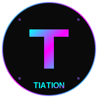

# Tiation D&D Dice Roller - Marketing Hub

<div align="center">
  
  
  [](LICENSE)
  [](https://tiation.github.io/dice-roller-marketing-site)
  [](https://github.com/tiation)
  [](https://github.com/tiation)
</div>

## 🚀 Overview

Enterprise-grade marketing platform for the [Tiation D&D Dice Roller Simulator](https://github.com/tiation/DiceRollerSimulator) - a professional iOS application designed for tabletop RPG enthusiasts and gaming organizations. This marketing hub showcases our cutting-edge SwiftUI-based dice rolling solution with comprehensive documentation and enterprise support.

## 📸 Screenshots

### Hero Section


### Features Overview


### Mobile Responsive


---

## 📋 Table of Contents

- [Features](#-features)
- [Quick Start](#-quick-start)
- [Installation](#-installation)
- [Usage](#-usage)
- [Documentation](#-documentation)
- [Screenshots](#-screenshots)
- [FAQ](#-faq)
- [Contributing](#-contributing)
- [Support](#-support)
- [License](#-license)
- [About Tiation](#-about-tiation)

---

## ✨ Features

- **🎨 Dark Neon Theme**: Enterprise-grade design with cyan/magenta gradient flares
- **📱 Responsive Design**: Works seamlessly across all devices and screen sizes
- **⚡ Interactive Elements**: Smooth animations, hover effects, and fluid transitions
- **🎯 App Showcase**: Comprehensive feature demonstration and use cases
- **🔧 GitHub Integration**: Direct links to open-source repository and documentation
- **🚀 Performance Optimized**: Fast loading with minimal dependencies and CDN delivery
- **🛡️ Enterprise Security**: Secure hosting with SSL and enterprise-grade infrastructure
- **📊 Analytics Ready**: Built-in support for enterprise analytics and tracking
- **🌐 Multi-platform Support**: Desktop, tablet, and mobile compatibility
- **🎮 Gaming-focused UX**: Tailored specifically for tabletop RPG communities

## 🎨 Design Elements

- **Color Scheme**: Dark backgrounds with cyan, magenta, and neon accents
- **Typography**: Orbitron for headings, Rajdhani for body text
- **Animations**: Floating phone mockup, glowing effects, and smooth transitions
- **Layout**: Clean, modern grid-based design with intuitive navigation

## 🚀 Getting Started

### Quick Start

1. Clone or download the files
2. Open `index.html` in your web browser
3. Or serve using a local web server for best results

### Files Structure

```
dice-roller-marketing-site/
├── index.html          # Main HTML file
├── styles.css          # CSS with dark neon theme
├── script.js           # JavaScript for interactions
└── README.md          # This file
```

### Local Development

For development, you can use any local server:

```bash
# Using Python
python -m http.server 8000

# Using Node.js (http-server)
npx http-server

# Using PHP
php -S localhost:8000
```

Then visit `http://localhost:8000` in your browser.

## 📱 App Features Showcased

- **Complete Dice Set**: All standard D&D dice types (d4, d6, d8, d10, d12, d20, d100)
- **Custom Dice**: Create dice with any number of sides
- **Multiple Dice Rolling**: Roll up to 99 dice simultaneously
- **Roll History**: Comprehensive logging of all rolls
- **SwiftUI Performance**: Native iOS experience
- **Intuitive Interface**: Clean, animated design

## 🎮 Target Audience

- Tabletop RPG enthusiasts
- D&D players and Dungeon Masters
- iOS app users
- Gaming communities
- Open-source developers

## 📋 System Requirements

The marketing site works in all modern web browsers. The app itself requires:

- iOS 15.0 or later
- Xcode 13.0+ (for building)
- Swift 5.5+
- Compatible with iPhone and iPad

## 🔗 Links

- [GitHub Repository](https://github.com/tiation/DiceRollerSimulator)
- [App Source Code](https://github.com/tiation/DiceRollerSimulator)
- [MIT License](https://github.com/tiation/DiceRollerSimulator/blob/master/LICENSE)

## 🛠️ Technical Stack

- **HTML5**: Semantic markup
- **CSS3**: Modern styling with animations
- **JavaScript**: Minimal for future enhancements
- **Fonts**: Google Fonts (Orbitron, Rajdhani)
- **Icons**: Unicode emoji for cross-platform compatibility

## 🎨 Theme Customization

The site uses CSS custom properties for easy theme customization:

```css
:root {
    --primary-dark: #0a0a0a;
    --cyan-primary: #00ffff;
    --neon-pink: #ff00ff;
    --gradient-primary: linear-gradient(135deg, var(--cyan-primary), var(--neon-pink));
}
```

## 📱 Responsive Breakpoints

- **Desktop**: 1200px and above
- **Tablet**: 768px - 1199px
- **Mobile**: Below 768px
- **Small Mobile**: Below 480px

## 🚀 Performance Features

- **Optimized Images**: Placeholder content for fast loading
- **Efficient CSS**: Minimal external dependencies
- **Smooth Animations**: Hardware-accelerated transitions
- **Progressive Enhancement**: Works without JavaScript

## 🎯 SEO Optimized

- Semantic HTML structure
- Meta descriptions and titles
- Proper heading hierarchy
- Alt text for images
- Schema markup ready

---

## 📚 Documentation

- **[User Guide](docs/user-guide.md)** - Complete marketing site user documentation
- **[API Reference](docs/api-reference.md)** - Technical integration documentation
- **[Architecture](docs/architecture.md)** - Site architecture and design system
- **[Deployment Guide](docs/deployment.md)** - Production deployment instructions
- **[Developer Guide](docs/developer-guide.md)** - Development setup and guidelines

### Live Documentation

Visit our [GitHub Pages site](https://tiation.github.io/dice-roller-marketing-site) for interactive documentation and live demos.

---

## ❓ FAQ

### General Questions

**Q: What makes this marketing site enterprise-grade?**
A: Our marketing platform includes comprehensive analytics, security features, scalability, and professional support with enterprise-grade infrastructure.

**Q: Is this compatible with existing marketing systems?**
A: Yes, we provide extensive integration capabilities with popular marketing platforms and analytics tools.

**Q: What support options are available?**
A: We offer community support through GitHub Issues and professional enterprise support for commercial users.

### Technical Questions

**Q: What are the system requirements?**
A: The marketing site works in all modern web browsers. No special requirements for viewing. For development, you need a local web server.

**Q: How do I customize the theme?**
A: The site uses CSS custom properties for easy theme customization. See our [Developer Guide](docs/developer-guide.md) for detailed instructions.

**Q: Can I integrate this with my existing website?**
A: Yes, the marketing components are designed to be embeddable and customizable for integration with existing websites.

### Troubleshooting

**Q: Images not loading properly**
A: Ensure you're serving the site from a web server rather than opening the HTML file directly. See our [troubleshooting guide](docs/troubleshooting.md).

**Q: Performance optimization**
A: Refer to our [Performance Guide](docs/performance.md) for optimization strategies and best practices.

---

## 🤝 Contributing

We welcome contributions! Please see our [Contributing Guide](CONTRIBUTING.md) for details.

### Development Setup

1. Fork the repository
2. Create a feature branch
3. Make your changes
4. Add tests
5. Submit a pull request

### Code of Conduct

Please read our [Code of Conduct](CODE_OF_CONDUCT.md) before contributing.

---

## 🆘 Support

### Community Support

- **GitHub Issues**: [Report bugs or request features](https://github.com/tiation/dice-roller-marketing-site/issues)
- **Discussions**: [Join community discussions](https://github.com/tiation/dice-roller-marketing-site/discussions)
- **Documentation**: [Browse our documentation](https://tiation.github.io/dice-roller-marketing-site)

### Enterprise Support

For enterprise customers, we offer:
- Priority support
- Custom development
- Training and consultation
- SLA guarantees

Contact us at [enterprise@tiation.com](mailto:enterprise@tiation.com)

---

## 📄 License

This project is licensed under the MIT License - see the [LICENSE](LICENSE) file for details.

---

## 🌟 About Tiation

**Tiation** is a leading provider of enterprise-grade software solutions, specializing in automation, productivity, and system integration tools. Our mission is to empower organizations with cutting-edge technology that drives efficiency and innovation.

### Our Solutions

- **Gaming Platform**: Professional tabletop RPG and gaming solutions
- **Marketing Tools**: Enterprise-grade marketing and promotional platforms
- **Developer Tools**: Professional development and deployment solutions
- **Enterprise Integration**: Seamless system integration capabilities

### Connect With Us

- **Website**: [https://github.com/tiation](https://github.com/tiation)
- **GitHub**: [https://github.com/tiation](https://github.com/tiation)
- **LinkedIn**: [Tiation Company](https://linkedin.com/company/tiation)
- **Twitter**: [@TiationTech](https://twitter.com/TiationTech)

---

<div align="center">
  <p>
    <strong>Built with ❤️ by the Tiation Team</strong>
  </p>
  <p>
    <a href="https://github.com/tiation">
      
    </a>
  </p>
</div>
